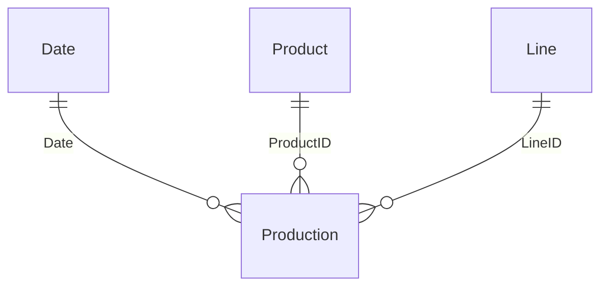

# Model gwiazdy

```mermaid
erDiagram
    Date ||--o{ Production : "Date"
    Product ||--o{ Production : "ProductID"
    Line ||--o{ Production : "LineID"
```

Jedna partia produkcyjna (BatchID), jeden produkt i jedna linia. Filtry przepływają wyłącznie z wymiarów do faktów. Nie łączymy tabel faktów bezpośrednio. 
